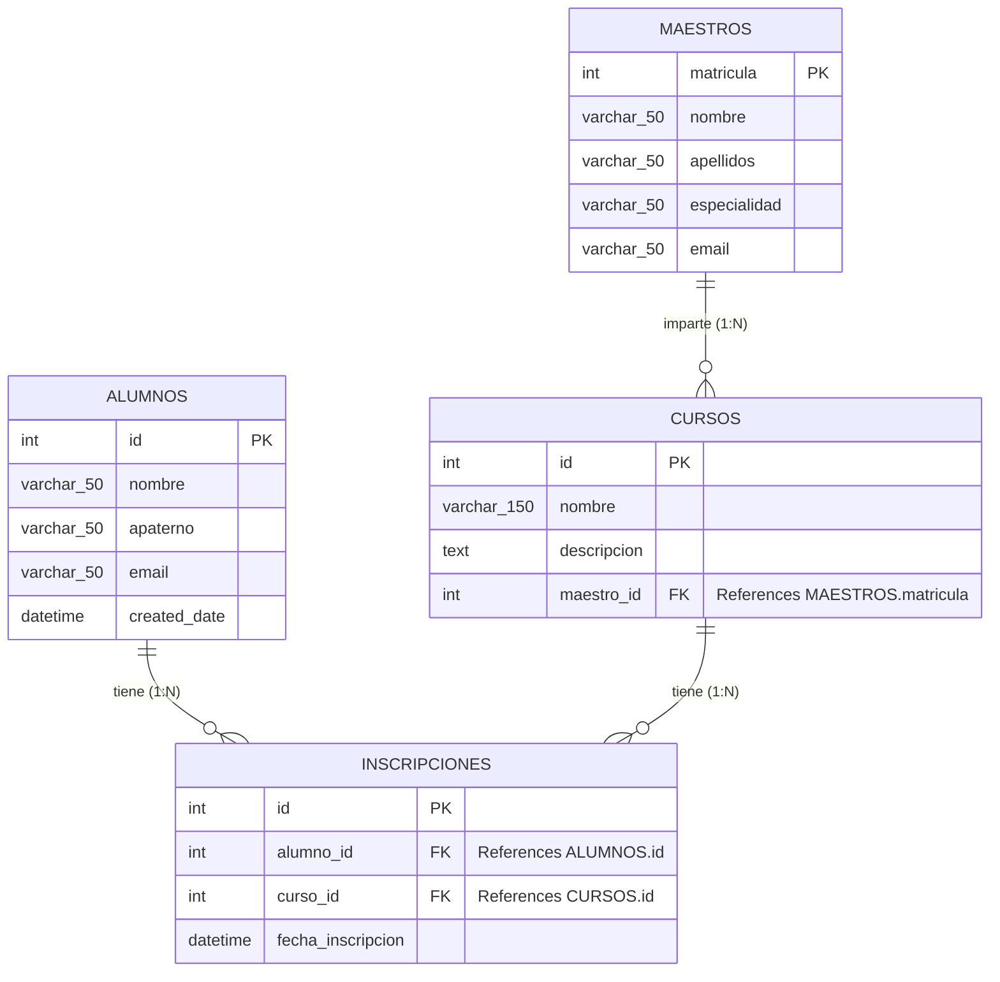

# Diagrama Relacional Resultante

A continuación se muestra el diagrama del modelo relacional resultante, basado en los modelos implementados con SQLAlchemy para Flask (Maestros, Alumnos, Cursos e Inscripciones).

## Detalles de las Relaciones
* **Uno a Muchos (Maestros - Cursos):** Un maestro puede impartir varios cursos, pero un curso pertenece a un único maestro. Esto se representa con `maestro_id` como clave foránea en la tabla `CURSOS`.
* **Muchos a Muchos (Alumnos - Cursos):** Un alumno puede inscribirse en varios cursos y un curso puede tener varios alumnos. Esto se logra mediante la tabla intermedia `INSCRIPCIONES`, la cual contiene las claves foráneas `alumno_id` y `curso_id`. Esta tabla también cuenta con una restricción de unicidad (`uq_alumno_curso`) para evitar que un alumno se inscriba dos veces al mismo curso.
